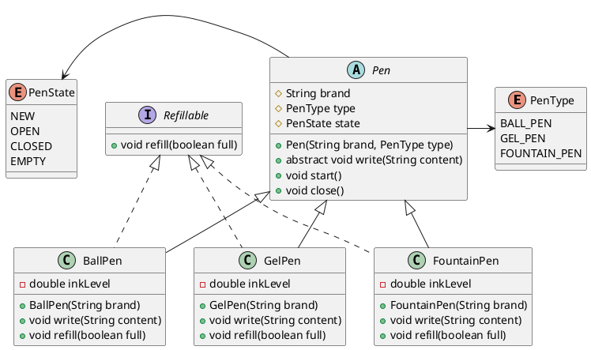

# Design a Pen - LLD Assignment

## Problem Statement
Design a Pen using Object-Oriented Principles. The pen should support different functionalities such as:
1. `start()`
2. `write()`
3. `close()`
4. `refill()`

## Requirements & Assumptions
- **Entities**: We are modeling different types of Pens (e.g., Ball Pen, Gel Pen, Fountain Pen).
- **Attributes**: A Pen typically has a `brand`, `type` (BALL_PEN, GEL_PEN, FOUNTAIN_PEN), and `state` (NEW, OPEN, CLOSED, EMPTY). Concrete implementations can track an `inkLevel`.
- **Functionalities**:
  - `start()`: Opens the pen (transitions state from CLOSED/NEW to OPEN).
  - `write()`: Checks if the pen is OPEN and not EMPTY. If both conditions are met, it simulates writing (deducts ink level).
  - `close()`: Closes the pen.
  - `refill()`: Refill mechanism strictly applies to pens that are refillable. Not all pens might be refillable, so we use a `Refillable` interface.

## Design Explanation
1. **Enums (`PenType`, `PenState`)**: Provides type safety and restricts values to pre-defined configurations representing the type of pen and its state.
2. **Interface (`Refillable`)**: Interface Segregation Principle specifies that only those pens which are refillable should implement this contract.
3. **Abstract Class (`Pen`)**: Holds common state and shared behaviors (like `start()`, `close()`), allowing code reuse. The `write()` method is left abstract so that concrete subclasses can specify their writing logic and ink consumption behavior.
4. **Concrete Classes (`BallPen`, `GelPen`, `FountainPen`)**: Provide explicit details of different types of pens.

## UML / Class Diagram



## How to Run
From the root of this project (`design-pen`):
1. Navigate to the `src` directory:
   ```bash
   cd src
   ```
2. Compile the Java files:
   ```bash
   javac com/example/pen/*.java
   ```
3. Run the application:
   ```bash
   java com.example.pen.App
   ```
