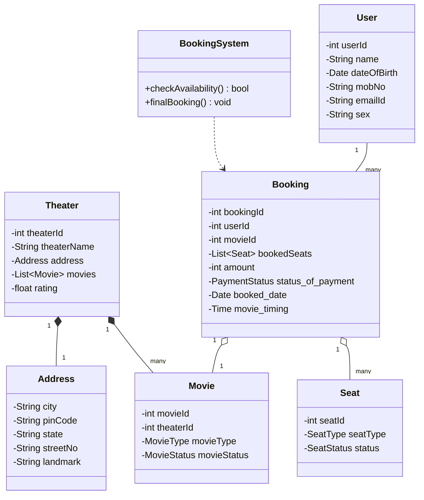

# Movie Ticket Booking System - Class Diagram

```mermaid
classDiagram
    class User {
        -int userId
        -String name
        -Date dateOfBirth
        -String mobNo
        -String emailId
        -String sex
    }

    class Movie {
        -int movieId
        -int theaterId
        -MovieType movieType
        -MovieStatus movieStatus
    }

    class Theater {
        -int theaterId
        -String theaterName
        -Address address
        -List~Movie~ movies
        -float rating
    }

    class Booking {
        -int bookingId
        -int userId
        -int movieId
        -List~Seat~ bookedSeats
        -int amount
        -PaymentStatus status_of_payment
        -Date booked_date
        -Time movie_timing
    }

    class Address {
        -String city
        -String pinCode
        -String state
        -String streetNo
        -String landmark
    }
    
    class Seat {
        -int seatId
        -SeatType seatType
        -SeatStatus status
    }
    
    class BookingSystem {
        +checkAvailability() bool
        +finalBooking() void
    }

    Theater "1" *-- "many" Movie
    Theater "1" *-- "1" Address
    Booking "1" o-- "many" Seat
    Booking "1" o-- "1" Movie
    User "1" -- "many" Booking
    BookingSystem ..> Booking
```
