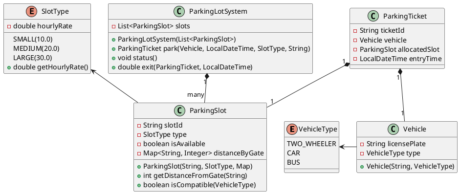

# Multilevel Parking Lot - LLD Assignment

## Problem Statement
Design a Multilevel Parking Lot system balancing diverse vehicles, pricing algorithms, multiple entry gates, and distance-based priority mapping.

### Functional Requirements
- Supports Small, Medium, Large parking slots.
- Maintains distinctive hourly parking charges based on **Slot Type**, not the Vehicle Type.
- `park()` generates a ticket tracking details, allocated slot, and entry timestamp.
- `exit()` checks ticket, calculates usage duration, and outputs the exact bill amount.
- **Priority Slot Allocation**: Multiple entry gates exist. Vehicles get assigned the nearest available compatible slot directly bounded precisely to their entry location.
- **Upgradability Rule**: 
  - 2-Wheeler -> Small, Medium, Large. 
  - Car -> Medium, Large. 
  - Bus -> Large.

## Design Explanation
1. **Core Models**: `Vehicle`, `ParkingSlot`, `ParkingTicket` encapsulated as robust POJOs encapsulating specific structural identifiers and metadata.
2. **Configuration Enums**: `VehicleType` limits constraints safely while `SlotType` binds directly to hourly currency `rates` ensuring zero decoupling risks.
3. **ParkingLotSystem**: Central class handling exact operations tracking slot inventory dynamically. Distances are abstracted to each slot using a flat mapping `Map<String, Integer> gateDistances`. The shortest distance from an origin gate determines assignment logically. O(n) scan logic prioritizes mapping closest components rapidly.

## UML / Class Diagram



## How to Run
From the root of this project (`parking-lot`):
1. Navigate to the `src` directory:
   ```bash
   cd src
   ```
2. Compile the Java files:
   ```bash
   javac com/example/parking/**/*.java
   ```
3. Run the application:
   ```bash
   java com.example.parking.App
   ```
