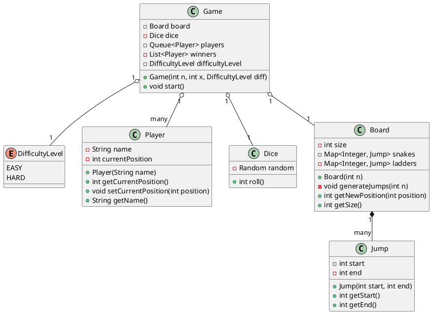

# Snakes & Ladders - LLD Assignment

## Problem Statement
Create a Snake and Ladder application.
- The application takes input `n` (size of the board `n x n`), `x` (number of players), and `difficulty_level` (easy/hard) from the user.
- There are `n` snakes and `n` ladders randomly placed based on the size of the board.
- Minimum 2 players to play the game, game continues until only 1 player remains (at least 2 players still playing).
- Dice: Random roll from 1 to 6.
- Moving outside position 100 boundaries does not move the piece.
- Snakes and Ladders do not create a cycle.

## Requirements & Assumptions
- **Entities**: We are modeling Core game components: `Board`, `Player`, `Dice`, `Game`, `Jump` (Snake/Ladder).
- **Assumptions**: 
  - `difficulty_level`: The core requirements dictate `n` snakes and `n` ladders strictly based on `n`. The difficulty level can be interpreted as affecting the placement behavior slightly (e.g. longer snakes in hard mode), but primarily acts as an open parameter to allow for dynamic extension.
  - Cycle Prevention: Jumps will be generated strategically to ensure start and end points do not overlap, effectively preventing infinite loop cycles.

## Design Explanation
1. **Model/Entities (`Player`, `Board`, `Dice`, `Jump`, `DifficultyLevel`)**: Provides self-contained data components strictly maintaining SRP (Single Responsibility Principle). The `Board` inherently handles board size and mapping Jumps (snakes and ladders).
2. **Controller (`Game`)**: Controls the logic. It maintains the Players queue and runs the turn-by-turn logic sequentially till only one player sits without finishing.
3. **Execution (`App`)**: Takes the dynamic User inputs, initializes the components, starts the gameplay, and outputs updates explicitly to verify correctness.

## UML / Class Diagram



## How to Run
From the root of this project (`snakes-ladders`):
1. Navigate to the `src` directory:
   ```bash
   cd src
   ```
2. Compile the Java files:
   ```bash
   javac com/example/snakesladders/*.java
   ```
3. Run the application:
   ```bash
   java com.example.snakesladders.App
   ```
